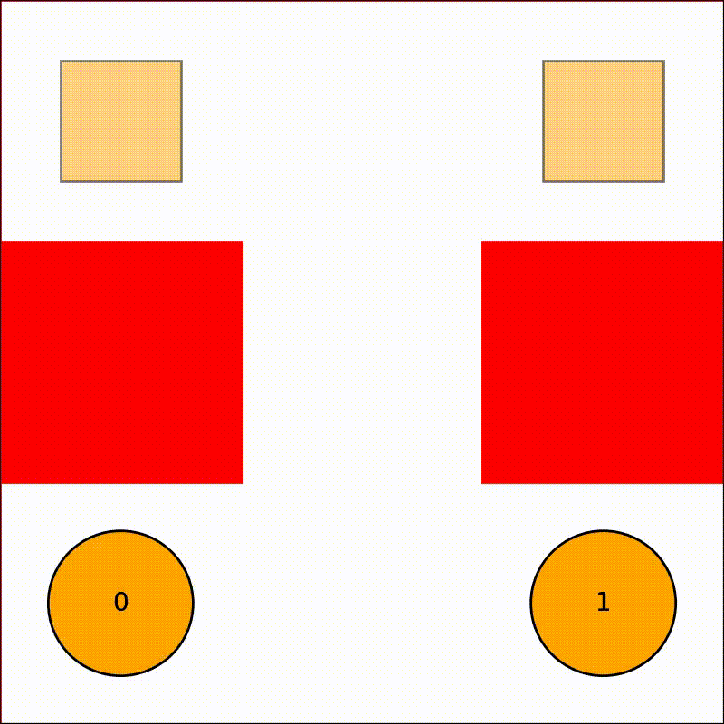
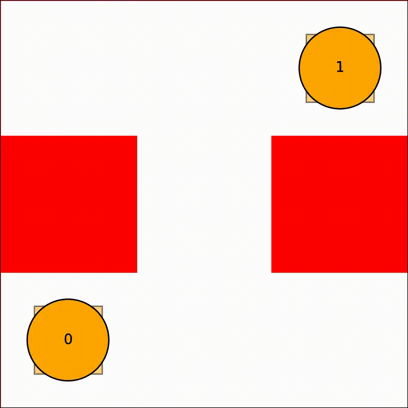
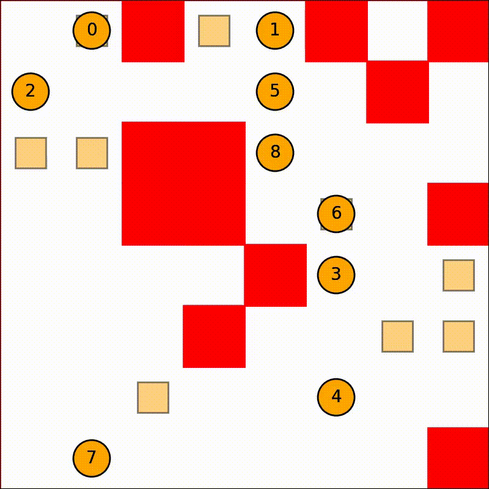
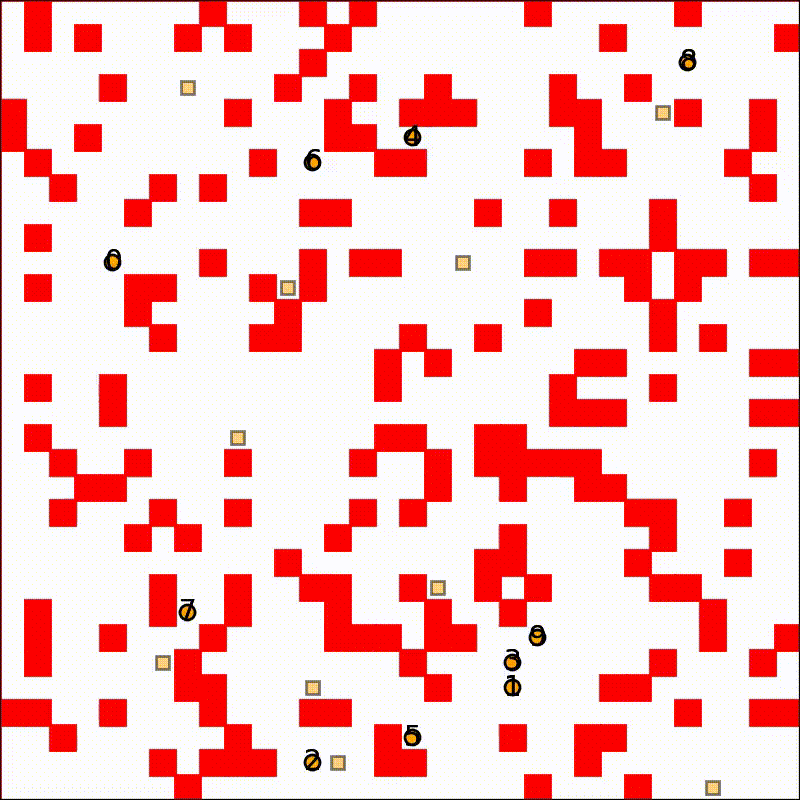
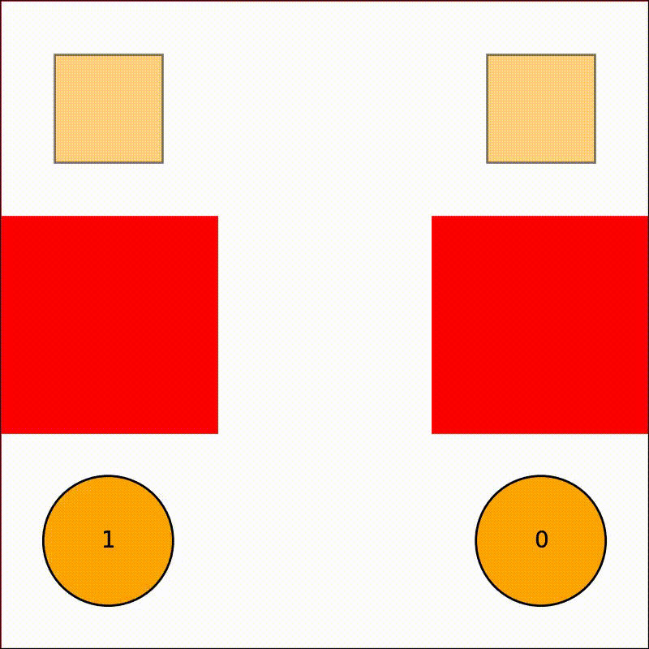
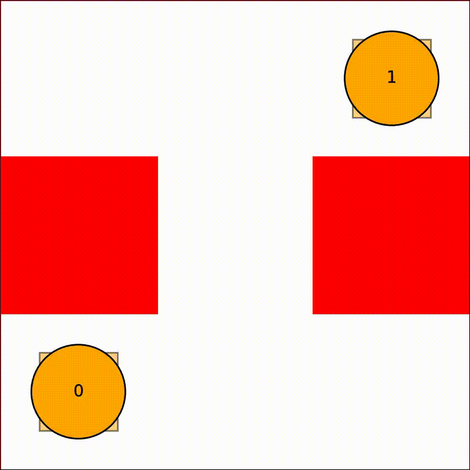
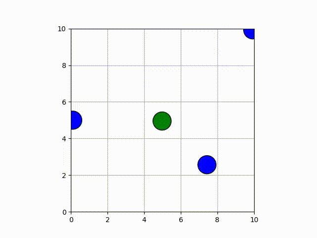
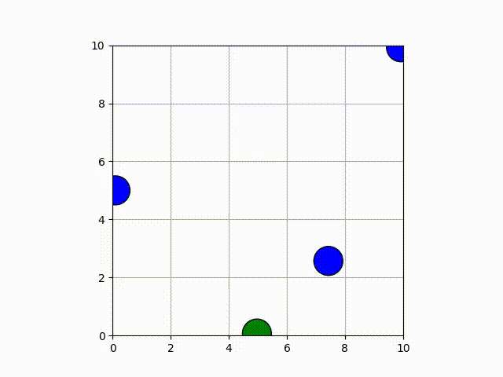
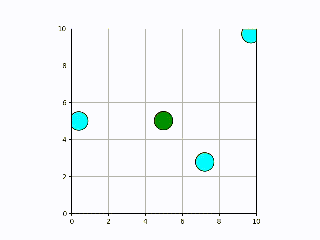
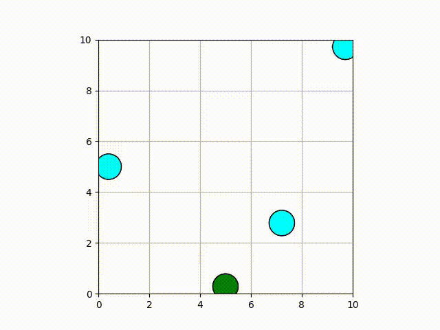

# Multi-Agent path planning in Python

## Introduction

This repository consists of the implementation of some multi-agent path-planning algorithms in Python. 

## Dependencies

Install the necessary dependencies by running.

```shell
python3 -m pip install -r requirements.txt
```

## Unified Execution

The recommended way to run all algorithms is through the unified `main.py` entry point. This script handles parameter loading, execution, and visualization.

```bash
python3 main.py --algo <algorithm> --input <input_yaml> --output <output_yaml> --visualize
```

## Scalability Analysis

The `scalability_analysis.py` script supports two workflows:

- `benchmark`: benchmark algorithms across varying agent counts by trimming the provided benchmark environments.
- `maps`: run a fixed agent count on the maps in `main-maps/`, randomizing start/goal positions each run (deterministically via `--seed`).

```bash
# Benchmark scalability for M*
python3 scalability_analysis.py benchmark --algo mstar

# Benchmark scalability for MiC
python3 scalability_analysis.py benchmark --algo mic

# Run the same agent count across maps (randomized starts/goals)
python3 scalability_analysis.py maps --algo cbs --agents 16 --runs 5 --seed 0

# Restrict to specific maps
python3 scalability_analysis.py maps --algo cbs --agents 16 --maps open.yaml,narrow-passages.yaml,cluttered.yaml
```

## Architecture

The project is structured to promote code reuse and a consistent interface across different planning strategies.

### Directory Structure

- `main.py`: The single entry point for all supported algorithms.
- `scalability_analysis.py`: Automation script for benchmarking across counts and for running fixed-count trials across `main-maps/` with randomized starts/goals.
- `utils/`: Shared utility modules used by multiple algorithms.
  - `a_star.py`: Robust implementations of Single-Agent A* and Joint-Agent A* with support for vertex and edge constraints.
  - `visualize.py`: Unified visualization logic that generates animated GIFs from planning results.
- `centralized/`: Implementations of centralized planning algorithms (CBS, M*, MiC, SIPP).
- `coupled/`: Implementation of a coupled planning approach.
- `decentralized/`: Decentralized approaches (Velocity Obstacles, NMPC).

### Adding Future Algorithms

To add a new algorithm to the unified interface:

1. **Implement the Logic**: Create your algorithm module (e.g., in `centralized/your_algo/`).
2. **Standardize the Interface**: Your solver should ideally take an `Environment` object and return a solution dictionary containing the `schedule`.
3. **Register in `main.py`**:
   - Add your algorithm's name to the `choices` list in the `--algo` argument.
   - Add an `elif args.algo == "your_algo":` block to handle imports and execution.

---

## Algorithms

<details>
<summary><b>Conflict Based Search (CBS)</b></summary>

Conclict-Based Search (CBS), is a multi-agent global path planner.

**Execution**

```bash
python3 main.py --algo cbs --input centralized/ma-cbs/input.yaml --output tests/out_cbs.yaml --visualize
```

*(Legacy Execution)*
```bash
cd ./centralized/cbs
python3 cbs.py input.yaml output.yaml
```

**Results**

|           Test 1 (Success)           |           Test 2 (Success)           |
|:------------------------------------:|:------------------------------------:|
| | |

|               8x8 grid              |              32x32 grid             |
|:-----------------------------------:|:-----------------------------------:|
|  | |

**Reference**
- [Conflict-based search for optimal multi-agent pathfinding](https://www.sciencedirect.com/science/article/pii/S0004370214001386)

</details>


<details>
<summary><b>Meta-agent Conflict-Based Search (MiC)</b></summary>

Meta-agent Conflict-based search groups agents into meta-agents to resolve conflicts that are difficult for standard CBS.

**Execution**

```bash
python3 main.py --algo mic --input centralized/ma-cbs/input.yaml --output tests/out_mic.yaml --visualize
```
</details>


<details>
<summary><b>M* (M-Star)</b></summary>

M* is a subdimensional expansion approach to multi-agent pathfinding that dynamically couples agents only when their independent paths conflict.

**Execution**

```bash
python3 main.py --algo mstar --input centralized/mstar/input.yaml --output tests/out_mstar.yaml --visualize
```
</details>


<details>
<summary><b>Coupled Planner</b></summary>

A coupled planner plans for all agents simultaneously in a joint configuration space, ensuring completeness but with higher computational cost.

**Execution**

```bash
python3 main.py --algo coupled --input coupled/test3_input.yaml --output tests/out_coupled.yaml --visualize
```
</details>


<details>
<summary><b>Prioritized Safe-Interval Path Planning (SIPP)</b></summary>

SIPP is a local planner, using which, a collision-free plan can be generated, after considering the static and dynamic obstacles in the environment. In the case of multi-agent path planning, the other agents in the environment are considered as dynamic obstacles. 

**Execution**

*(Legacy Execution)*
```bash
cd ./centralized/sipp
python3 multi_sipp.py input.yaml output.yaml
```

**Results**

|            Test 1 (Success)            |            Test 2 (Failure)            |
|:--------------------------------------:|:--------------------------------------:|
|  | |

**Reference**
- [SIPP: Safe Interval Path Planning for Dynamic Environments](https://www.cs.cmu.edu/~maxim/files/sipp_icra11.pdf)

</details>


<details>
<summary><b>Velocity Obstacles</b></summary>

In this approach, it is the responsibility of each robot to find a feasible path. Each robot sees other robots as dynamic obstacles, and tries to compute a control velocity which would avoid collisions with these dynamic obstacles.

**Execution**

*(Legacy Execution)*
```bash
cd ./decentralized
python3 decentralized.py -f velocity_obstacle/velocity_obstacle.avi -m velocity_obstacle
```

**Results**

- Test 1: The robot tries to stay at (5, 5), while avoiding collisions with the dynamic obstacles
- Test 2: The robot moves from (5, 0) to (5, 10), while avoiding obstacles

| Test 1|Test 2|
| :------------: | :------------: |
|||

**References**
- [The Hybrid Reciprocal Velocity Obstacle](http://gamma.cs.unc.edu/HRVO/HRVO-T-RO.pdf)

</details>


<details>
<summary><b>Nonlinear Model-Predictive Control (NMPC)</b></summary>

In this approach, similar to velocity obstacles, each robot computes its control to avoid dynamic obstacles.

**Execution**

*(Legacy Execution)*
```bash
cd ./decentralized
python3 decentralized.py -m nmpc
```

**Results**

- Test 1: The robot tries to stay at (5, 5), while avoiding collisions with the dynamic obstacles
- Test 2: The robot moves from (5, 0) to (5, 10), while avoiding obstacles

| Test 1|Test 2|
| :------------: | :------------: |
|||

**References**
- [Nonlinear Model Predictive Control for Multi-Micro Aerial Vehicle Robust Collision Avoidance](https://arxiv.org/abs/1703.01164)

</details>

---

## Post-Processing

### Post-processing with TPG

The plan, which is computed in discrete time, can be postprocessed to generate a plan-execution schedule, that takes care of the kinematic constraints as well as imperfections in plan execution.

This work is based on: [Multi-Agent Path Finding with Kinematic Constraints](https://www.aaai.org/ocs/index.php/ICAPS/ICAPS16/paper/view/13183/12711)

Once the plan is generated using CBS, please run the following to generate the plan-execution schedule:

```shell
cd ./centralized/scheduling
python3 minimize.py ../cbs/output.yaml real_schedule.yaml
```

Reference: Original implementation based on [atb033/multi_agent_path_planning](https://github.com/atb033/multi_agent_path_planning).
